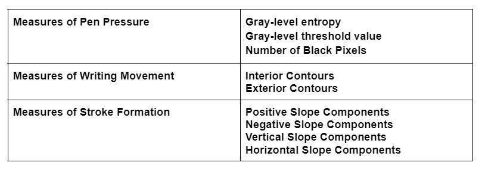

# Handwriting Features

Implementation of the methods for extracting handwriting features proposed by [Srihari et al.](https://cedar.buffalo.edu/papers/articles/Individuality_Handwriting_2002.pdf) 

## Installation

Clone the repository, go to the root level and execute `pip install .`

## Usage
```
import hw_features
hw_ features.all('sample.jpg')
```

## Features

Following are the handwriting features that are extracted



### Measures of Pen Pressure 

Measures of Pen Pressure indicate the darkness of writing as writes who would put more pressure would have darker writing while writers who wouldn’t put pressure would have lighter writing. There are three measures of pen pressure, i.e., gray-level distribution, gray-level threshold value and the number of black pixels.

### Measures of Writing Movement

There are two measures of writing movement, interior and exterior contours. Given an image of handwritten text, the image is binarized and its contours are detected. Contours that are contained within a contour are called interior contours while contours that are not contained within any contour are called exterior contours. Writing that is more cursive would have more interior contours whereas straight 

### Measures of Stroke Formation

Positive, Negative, Horizontal and Vertical Slope components are four measures of stroke formation. To compute these slopes, the contours of handwritten text are approximated and each slope (line between two points) is classified as either positive or negative and horizontal or vertical. A slope is positive if it rises from left to right while a slope is negative if it moves downwards.
